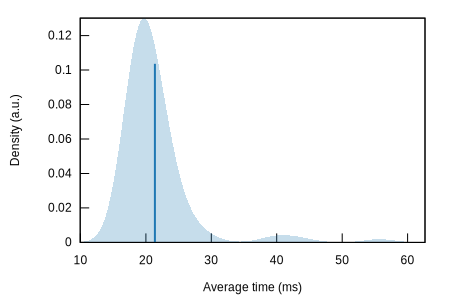
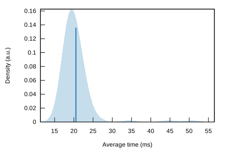
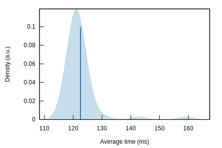

A few measurements were made to estimate approximate time of handshake 
completion.

For viewing full reports you need to download containing it folder and
open `index.html`.

1. Without HFS ([full report](ninn_ninn_none_report))
   
2. Using Kyber512 ([full report](ninn_ninn_Kyber512_report))
   
3. Using SIKE-p434 ([full report](ninn_ninn_SIKE-p434_report))
   
